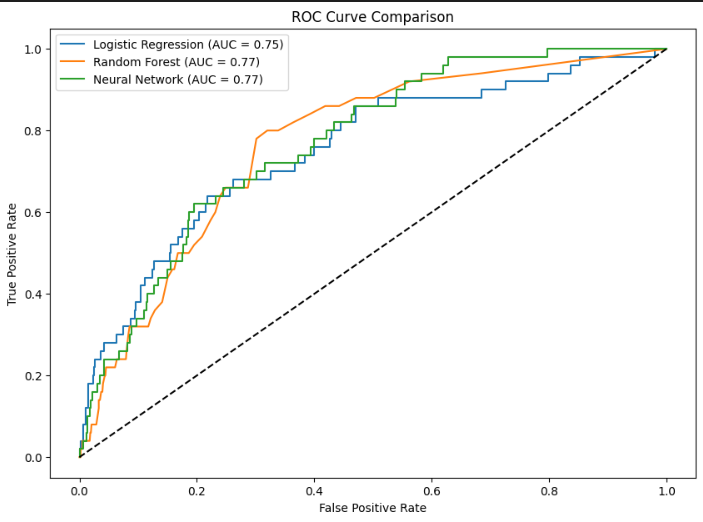

# Comprehensive Stroke Prediction & Patient Profiling Project

##  Introduction

This project presents a multi-faceted data science analysis of a healthcare dataset on stroke patients. The primary objective is twofold:
1.  [cite_start]**Unsupervised Analysis:** To uncover hidden patterns and natural patient groupings using K-Means Clustering and to identify co-occurring risk factors through Apriori Association Rule Mining [cite: 430, 435-436].
2.  [cite_start]**Supervised Prediction:** To build, evaluate, and compare several machine learning models to predict the likelihood of a patient experiencing a stroke [cite: 430, 433-434].

This repository demonstrates a complete data science workflow, from data cleaning and preprocessing to advanced modeling and interpretation of the results.

---

##  The Dataset

The analysis is based on the "Stroke Prediction Dataset", publicly available on Kaggle.

**Source:** [Kaggle - Stroke Prediction Dataset](https://www.kaggle.com/datasets/fedesoriano/stroke-prediction-dataset)

The data contains demographic, medical, and lifestyle information for approximately 5,000 patients. Key features include:
* **Demographic:** Age, gender, marital status.
* **Medical:** Hypertension, heart disease, average glucose level, BMI.
* **Lifestyle:** Work type, residence area, smoking status.
* **Target Variable:** `stroke` (1 for stroke, 0 for no stroke).

---

##  Project Workflow & Methodology

The project was executed in three main stages after initial data cleaning and preprocessing.

### 1. Unsupervised Learning: K-Means Clustering

[cite_start]To identify natural patient profiles without prior knowledge of their stroke status, the **K-Means** algorithm was applied[cite: 53]. [cite_start]The optimal number of clusters was determined to be **three** using the Elbow Method, which minimizes the Sum of Squared Errors (SSE)[cite: 71, 73].

The analysis revealed three distinct patient clusters:
* **Cluster 1 (Young & Healthy):** Characterized by younger age, lower BMI, and a general lack of pre-existing conditions. [cite_start]This group had the lowest stroke incidence at **1.6%**[cite: 241, 251].
* **Clusters 0 & 2 (Older & At-Risk):** These groups were very similar, characterized by older age, higher BMI, and a higher prevalence of comorbidities. [cite_start]Their stroke risk was over **4 times higher**, at approximately **6.6%** [cite: 242-243, 255].

### 2. Association Rule Mining: Apriori Algorithm

[cite_start]The **Apriori algorithm** was used to find frequent itemsets and generate association rules, highlighting which patient attributes often appear together [cite: 3, 5-6].

**Key Findings:**
* [cite_start]**Rules for No Stroke (`stroke=0`):** Being married and in the older age group was strongly associated with *not* having a stroke [cite: 24-27]. This may indicate better care or lifestyle management in this demographic.
* **Rules for Stroke (`stroke=1`):** The analysis identified several high-risk combinations. [cite_start]The strongest rules, with a **Lift greater than 4.0** (indicating a strong relationship), consistently involved a combination of **heart disease, high glucose levels, and older age** [cite: 38-39, 42].

### 3. Supervised Learning: Stroke Prediction

To predict the likelihood of a stroke, three different supervised learning models were trained and evaluated. The dataset is highly imbalanced (~5% positive cases), so the training data was balanced using the **SMOTE** technique. The primary evaluation metric was **Recall (Sensitivity)**, as correctly identifying a patient at risk of a stroke is clinically far more important than avoiding false positives.

The models evaluated were:
1.  **Logistic Regression**
2.  **Random Forest**
3.  **Feedforward Neural Network**

---

##  Results & Key Findings

The performance of the predictive models was carefully compared to determine the most suitable approach for this clinical problem.

### Predictive Modeling Results

The table below summarizes the performance of each model on the test set. The focus is on the metrics for the positive class (`stroke=1`).

| Model | Accuracy | Recall (Sensitivity) | Precision | F1-Score | ROC AUC |
| :--- | :---: | :---: | :---: | :---: | :---: |
| **Random Forest** | 0.92 | 0.20 | 0.19 | 0.19 | 0.77 |
| **Logistic Regression**| 0.82 | **0.54** | 0.14 | 0.22 | 0.75 |
| **Neural Network** | 0.81 | 0.48 | 0.12 | 0.20 | 0.77 |

### ROC Curve Comparison

The ROC curves show that all models perform significantly better than random chance, with Random Forest and the Neural Network having a slightly better overall discriminatory power (AUC = 0.77).

### Analysis of Results
* The **Random Forest** model, despite having the highest overall accuracy, performed poorly on the most critical metric, **Recall (0.20)**. [cite_start]It failed to identify 80% of the actual stroke cases, making it unsuitable for this clinical application[cite: 443].
* The **Logistic Regression** and **Neural Network** models both achieved a much higher **Recall (0.54 and 0.48, respectively)**. This means they were significantly better at identifying at-risk patients, even though it came at the cost of lower precision (more false positives).
* Given the clinical importance of maximizing true positives, the **Logistic Regression** model emerged as the most effective and reliable model from this analysis.

---

##  Conclusion

This project successfully combined unsupervised and supervised learning techniques to gain a deep understanding of stroke risk factors.

1.  **Patient Profiles Exist:** Clustering and association rules confirmed that distinct, data-driven patient profiles exist, with age, heart disease, and glucose levels being the most significant indicators of high risk.
2.  **Recall is the Key Metric:** For medical prediction tasks, prioritizing recall over accuracy is crucial. A model that can successfully identify the majority of true cases is more valuable, even if it produces some false alarms.
3.  **The Best Model isn't Always the Most Complex:** In this specific case, the simpler **Logistic Regression** model provided the best performance for the clinical objective, outperforming the more complex Neural Network in terms of recall. This highlights the importance of choosing the right tool for the specific problem and dataset.

---

##  How to Run

1.  Clone this repository to your local machine.
2.  Ensure you have all the required Python libraries installed (listed at the top of the notebook).
3.  Place the `stroke_data.xlsx` file in the same directory.
4.  Run the cells in the `Stroke_Prediction_Project.ipynb` notebook sequentially.
